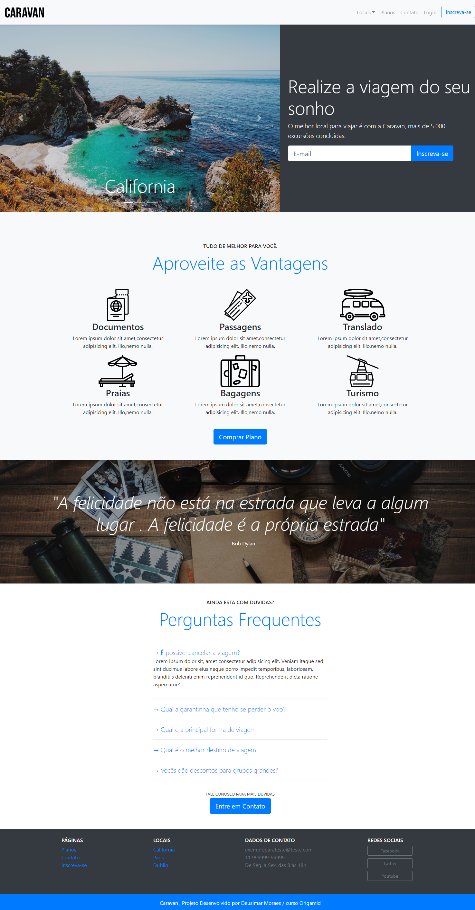
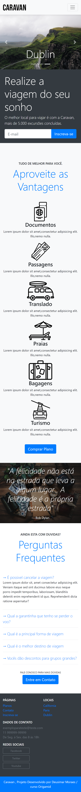

<h1>Caravan<h1>
  
link para ver o projeto <a href="https://caravan-eq56n3dze-deusimarmms.vercel.app/index.html">Aqui</a>

Projeto Caravan Desenvolvido em Bootstrap 4

É uma página que fala a respeito sobre viagens para California ,Paris e Dublin. foram criados links para direcionamento das outras paginas
Locais que é uma pagina exclusiva de galeria , Planos onde fica uma seleção de plano com um formulario de seleção e um botão de comprar plano que ao clicar encaminha para a pagina de inscreva-se na qual existe um formulario mais completo com dados do usuário como Nome , CPF,Email,Senha , Endereço Cidade ,Estado , CEP, Formas de Pagamento e dados para cartão  e um formulario de seleção para qual o usuário seleciona o local que deseja fazer a viagem.
uma página de contato na qual mostra um formulario de preenchimento com os dados e a mensagem do usuário , ao lado possui um mapa com os dados de contato também
e uma sessão com perguntas frequentes. 

Versão para Dispositivos Moveis

